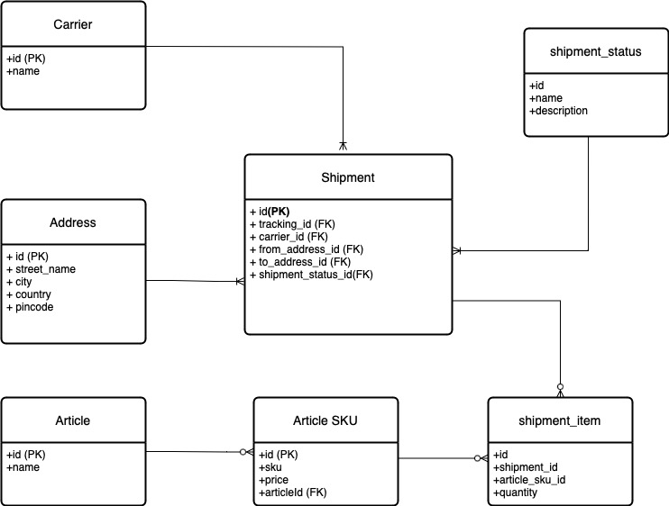

# Shipment Tracking System

The Shipment Tracker app is a web-based application designed to help users track and manage shipments from various carriers along with Weather Information. 

## Key Features

- **Shipment Tracking**: Easily track shipments by entering tracking IDs or Carrier IDs.
- **Shipment Details**: View detailed information about each shipment, including addresses and article details.
- **Weather API Integration**: Integration with Weather APIs to provide weather information while shipment delivery

## Components

- Python: Version 3.11
- FastAPI: Version 0.100.0
- Uvicorn: Version 0.22.0
- Pydantic: Version 2.0.2
- SQLAlchemy: Version 2.0.18
- Alembic: Version 1.11.1
- Redis: Version 4.6.0
- Postgres Version 15.3

## ER Diagram



## Weather Info Implementation  

An API Integration with external provider Weather Api [https://www.weatherapi.com] is implemented.

Distributed caching is choosen instead of local cache so that in a mulitple workers or pods will have access to data and API call to the external provider can be reduced.  

## Local Setup

## To run the tracker you need docker-compose 

1. Clone this repository 

```https://github.com/haripkrish/tracker```

2. Run the docker build command to build image of the tracker app.

```docker build -t tracker_backed:1.0 . ```

3. Run the docker compose up to bring up all the components

```docker-compose up -d --build --force-recreate --renew-anon-volumes```

-  There are four services as part of the Docker Compose configuration for the "Tracker" application:
    -  tracker-app -> Webserver FastAPI
    -  tracker-postgres  
    -  tracker-redis -> For caching weather data
    -  tracker-postgres-test -> To run our test cases
-  **Please note: There is a 10 seconds delay for the application to start for loading all the dependencies** 
4. The HTTP API will be accessible using the port 8000 and the docs will be available at 
```http://localhost:8000/docs```

5. Run the docker compose down to bring down all the components 

```docker-compose down -v```

## Testing the app

- Test data is populated before the application starts using a script that utilizes the Faker library. The script is located at app/db/data_populator
- Test cases are available for all the crud operations and API's at app/tests

## Test with API

To test the functionality of the shipment create and list API endpoints, you can follow these steps:

-  Start the application: Ensure that the application is running and the API endpoints are accessible by calling the following endpoint
```localhost:8000/```
-  Send a POST request to the shipment create endpoint: ```localhost:8000/api/v1/shipments/``` with a sample request object as:
- ```
  {
    "tracking_id": "TN87172630",
    "carrier": {
        "name": "Hövel Gumprich AG & Co. KG"
    },
    "shipment_status": {
        "name": "created",
        "description": "Shipment created"
    },
    "source_address": {
        "street_name": "Gutestr. 7/2",
        "city": "Goslar",
        "country": "Ecuador1",
        "pincode": "5364"
    },
    "destination_address": {
        "street_name": "Giorgio-Wesack-Gasse 34",
        "city": "Osterburg",
        "country": "Estland1",
        "pincode": "88233"
    },
    "shipment_item": [
        {
            "quantity": 5,
            "article_sku": {
                "sku": "dd419568-12bf-4d18-b592-446018897eag",
                "price": "41",
                "article": {
                    "name": "Keyboard112"
                }
            }
        },
        {
            "quantity": 3,
            "article_sku": {
                "sku": "e293e58c-e9fb-49ec-afd3-a32678c46499",
                "price": "71",
                "article": {
                    "name": "Mouse51"
                }
            }
        }
    ]
  }

- Send a GET request to the shipment list endpoint with optional query parameters as
  - tracking_id
  - carrier_id
- The following manual tests can be performed: 
  - List all the shipments
  - list all the shipments that belongs to a carrier
  - Get shipment by tracking id

  - ****Please notice that the first fetch will take longer as an external API call is made but subsequent calls will be quicker****

### Out of scope
Monitoring - Graphana, Prometheus
Deploying - Worker based using Gunicorn or pod based in kubernetes based on use-case
Load test - Locust
